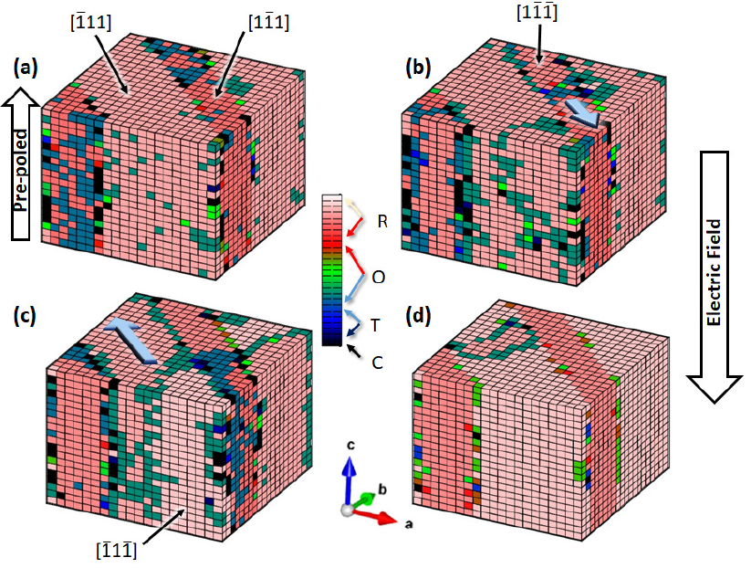

I am trained researcher passionate about developing computer models to creatively solve real-world problems. I have a strong background in analytical and numerical modelling. I am experienced at delivering technical presentations to a range of audiences, writing grants and publishing state-of-the-art research. Over my research career I have demonstably honed my project and time management skills. As a competent self-starter I am able to work both independently and cooperatively in diverse teams.

## Current Research
I am currently working as a post-doctoral research scientist in the Materials Modelling and Validation Group at the Culham Centre for Fusion Energy. I am researching radiation damage mitigation for reactor materials using scalable computational models. I am a developer of the [spin-lattice dynamics code SPILADY](https://ccfe.ukaea.uk/resources/spilady/) integrating new features including multi-component simulations, correlation functions and most recently the development of novel artifical neural networks.

## Doctoral Research
I completed my doctorate at University College London in 2018 in a joint collaboration with the National Physical Laboratory. My thesis which investigated domain dynamics and finite size effects of ferroelectric materials won the "Marshall Stoneham prize for Outstanding Research in Condensed Matter Theory" .

## Undergraduate Research
I started my research career studying theoretical physics at the University of York. For a Nuffield Foundation sponsored summer scholarship and later my Masters project I researched exact correlation in time dependent quantum systems collaborating in the development of the [iDEA code](https://pypi.org/project/idea-code/).

## For more info
------
[More info about UKAEA visit](https://www.gov.uk/government/organisations/uk-atomic-energy-authority/about).
