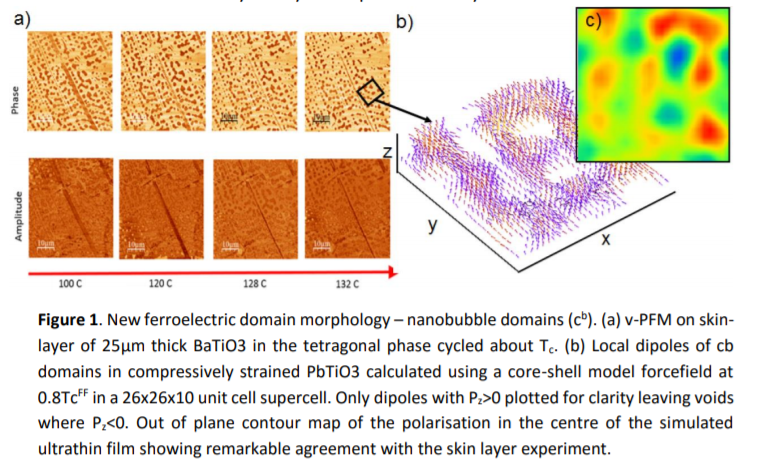

<u>J.B.J. Chapman</u>, J. M. Gregg, A. Schilling, A. V. Kimmel & D. M. Duffy

Ferroelectric ultrathin films have shown huge potential for the next generation of emergent technologies that aim to develop concepts to integrate and exploit exotic and novel
phenomena in dimensionally constrained materials. Domain walls in thin films have shown promising functionalities through induced electrical and magnetic properties, and unusual phases not present in the bulk domain interior. Recent direct observation of so-called wandering domain walls in thin films [1] and the ability to control the direction of the domain wall normal offer gateways for tuning intrinsic ferroelectric and piezoelectric properties.

In this work the properties of strained PbTiO3 ultra-thin films (UTF) were studied using molecular dynamics implemented in the DL POLY code [2] applying an adiabatic core-shell
forcefield derived in ref. [3]. Three dimensional periodic boundary conditions were imposed so the UTF is continuous and infinite along the pseudocubic [100]p and [010]p directions. A 100 Å vacuum gap in the growth direction [001]p was used to separate slab-image interactions. The initial slab configuration was set to include two ideal Kittel domains. A Pertsev (misfit-strain vs temperature) diagram for the PbTiO3 was calculated using this model, demonstrating the local behaviour of polarisation with the domains.

In addition to the previously predicted flux-closure and in-plane domain morphologies [4,5], our model predicts an entirely new domain phase at temperatures above the flux-closing Landau-Lifshitz stripe domain patterning (cd) but below Tc. Our simulations show that in the compressive strain regime, in vicinity of the effective Curie temperature, the homogeneity of the stripe cd domains along the in-plane [010]p direction breaks down. This is due to diffuse nucleation and growth of the reverse domain on the domain walls, shown previously as a growth mechanism in bulk prototypical systems under an activation field using a LandauGinzburg-Devonshire model [6]. This first presents by the distortion of the 180° domain wall alignment with (100) planes, so-called ‘wandering’ [1,4]. Here we observed that with further temperature increases leading to polarisation reduction, the degree of the anisotropy increases resulting in the domain wall pattern changing from linear stripe domains into the
bubble domain pattern (Fig. 1).

We also observed bubble domains in an experimental study of BaTiO3 crystals. Vertical PFM data was taken on a thin single crystal of flux-grown BaTiO3. The total thickness of the crystal was of the order of 25 μm. After successive cooling and heating through the Curie temperature, the PFM surface contrast progressively changed. Initially ferroelastic stripe domains were observed evolving to finely spaced bubble patterns of 180° domains with polarisation in and out of the surface plane (Fig. 1 a). The observed domain morphology bears a striking similarity to the modelled morphology (Fig. 1 b-c). Imaging on a transmission polarized optical microscope reveals that the ferroelastic domains remained but were not evident in the surface region imaged by PFM. We conclude the observed bubble domains were a feature of the skin layer only and representable by our strained UTF model.

[1] C.-L. Jia et al, Science 331, 1420 (2011)
[2] I.T. Todorov et al, J. Mater. Chem. 16, 1911 (2006)
[3] O. Gindele, A.V. Kimmel & D.M.Duffy, J. Phys. Chem. C 119, 17784 (2015)
[4] N.A. Pertsev, A.G. Zembilgotov & A.K. Tagantsev, Phys. Rev. Lett. 93, 196104 (2004)
[5] Z. Jiang et al, Phys. Rev. B 89, 214113 (2014)
[6] Y.-H.Shin et al, Nature 449, 881 (2007)
